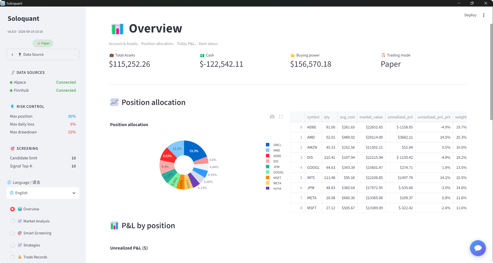
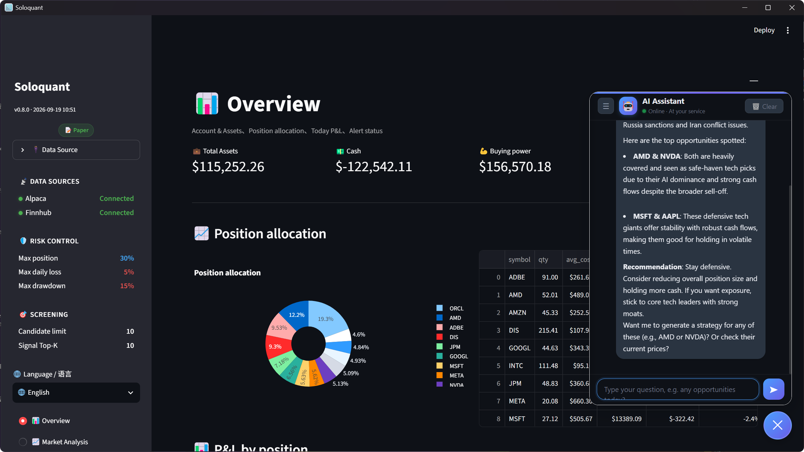
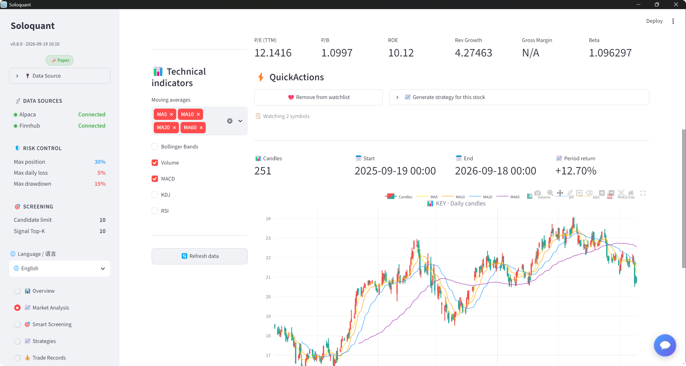
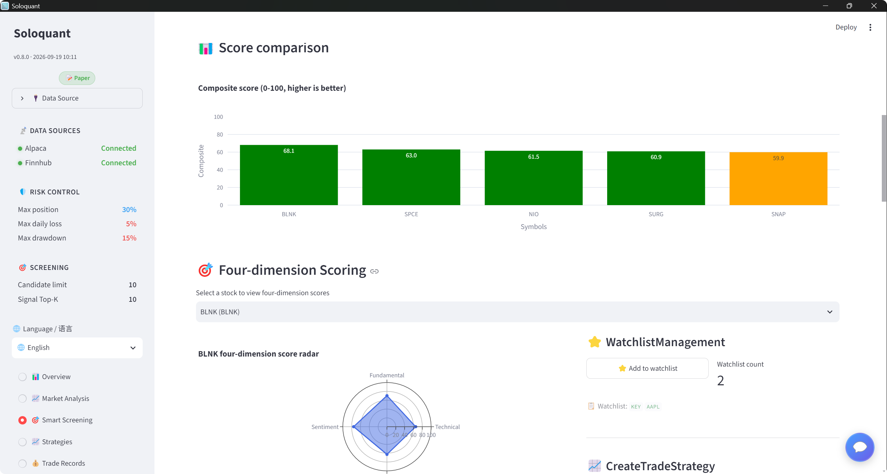
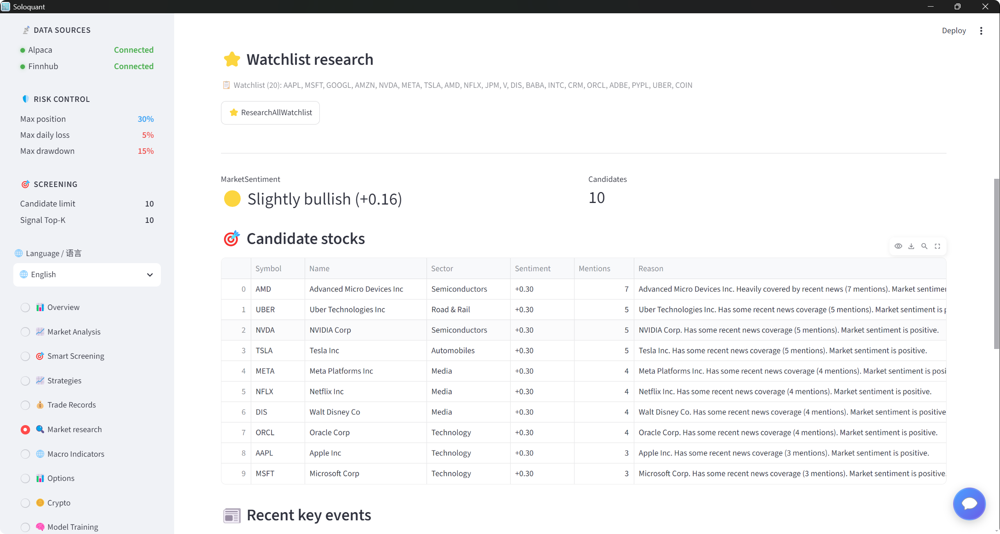
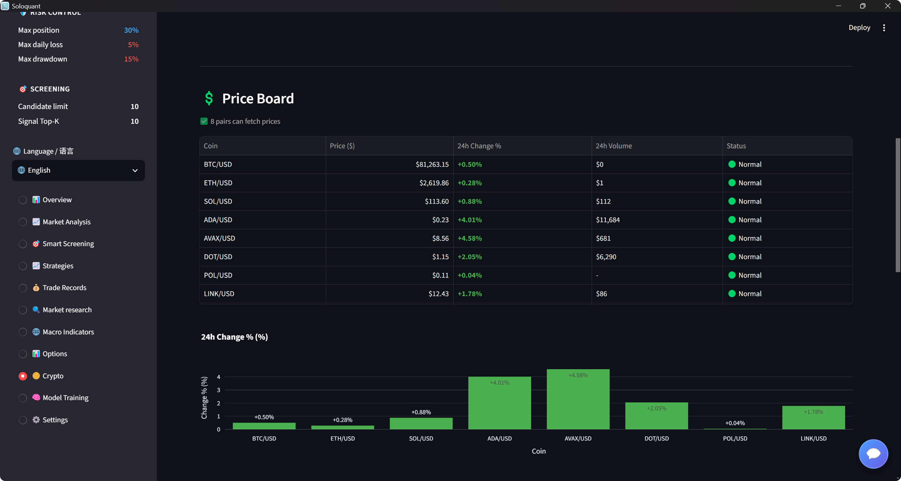

<div align="center">


# Soloquant

### 🤖 AI 全自动美股量化交易系统

**用大白话告诉它你想做什么，剩下的交给 AI**

从市场调研 → 智能选股 → 策略生成 → 回测验证 → 模拟交易 → 持仓监控，全流程自动化

[](LICENSE)
[](https://www.python.org/)
[](#-roadmap)
[](https://streamlit.io/)
[](https://alpaca.markets/)

**简体中文** | [English](README_EN.md)

**📖 快速导航** · [快速开始](#-快速开始) · [核心功能](#-核心功能) · [系统架构](#-系统架构) · [User Guide / 使用指南](docs/guides/user_guide.md) · [Deployment Guide / 部署指南](docs/guides/deployment_guide.md) · [加入微信群](#-加入社区)

</div>

---

## 📸 界面预览

<table>
<tr>
<td width="50%">

**📊 总览首页**



*账户资产、持仓分布、今日盈亏、风控告警状态一目了然*

</td>
<td width="50%">

**💬 AI 智能助手**



*像聊天一样分析市场：AI 自动汇总新闻情绪、识别机会、给出操作建议*

</td>
</tr>
<tr>
<td width="50%">

**📈 行情分析**



*专业 K 线图 + MA/MACD/RSI/Bollinger 等技术指标，一键生成交易策略*

</td>
<td width="50%">

**🎯 智能选股**



*四维评分雷达图（技术面/基本面/情绪面/资金面），候选股横向对比*

</td>
</tr>
<tr>
<td width="50%">

**🔍 市场调研**



*自动抓取自选股新闻热度与市场情绪，生成候选股调研报告*

</td>
<td width="50%">

**₿ 加密货币**



*BTC/ETH/SOL 等主流币对实时行情看板，7×24 小时不间断*

</td>
</tr>
</table>

---

## 💡 这是什么？

Soloquant 是一个**面向普通人的 AI 量化交易系统**。你不需要懂编程、不需要懂金融术语，只需要像聊天一样告诉它：

> *"帮我选 5 支 10 美元左右的潜力股"*
> *"最近市场怎么样？有什么机会？"*
> *"帮 NVIDIA 生成一个交易策略"*

它会自动完成剩下的所有事情：

```
🔍 市场调研 → 📊 智能选股 → 📈 策略生成 → 🧪 回测验证 → 💰 模拟下单 → 🛡️ 风控监控
```

**全程使用 Alpaca Paper Trading 模拟盘，零资金风险，放心折腾。**

---

## ✨ 为什么选择 Soloquant？

### 🗣️ 真正的自然语言交互
不是简单的关键词匹配，而是 **LLM 驱动的完整意图理解**：多轮对话记忆、上下文感知（知道你当前在哪个页面）、能调用系统全部功能。AI 助手会主动分析持仓、解读新闻、提示风险。

### 🧠 完整的量化研究流水线
基于 **Microsoft Qlib** 的工业级量化框架：自动因子挖掘 → LightGBM/LSTM 模型训练 → 信号生成 → 历史回测。策略上线前必须通过 **A/B/C/D 四级评级**，不合格自动拦截。

### 🛡️ 七重风控保护
单票仓位上限、单日亏损止损、最大回撤熔断、信号 Top-K 过滤……7 条风控规则全自动执行，从系统层面杜绝"上头"操作。

### 🏗️ 云端 + 本地分布式架构
数据采集与模型训练跑在云端服务器，本地仪表盘轻量流畅。也支持纯本地一键启动，两种部署模式自由切换。

### 🌍 中英双语界面
内置 i18n 国际化，仪表盘一键切换中文/English，海外用户无障碍使用。

### 🖥️ 桌面版开箱即用
基于 Electron 打包的桌面安装版，**双击即用，无需安装 Python 和任何依赖**（见 [Releases](../../releases)）。

---

## ✨ 核心功能

| 功能 | 说明 |
|------|------|
| 🔍 **智能选股** | 四维评分体系（技术面/基本面/情绪面/资金面），一句话筛选候选股，支持关注列表管理 |
| 🤖 **AI 智能助手** | LLM 驱动的自然语言交互，理解意图、调用系统全部功能、多轮对话记忆、上下文感知 |
| 📈 **策略生成** | 基于 Microsoft Qlib 自动挖掘因子、训练模型（LightGBM/LSTM）、生成交易信号 |
| 🧪 **回测验证** | 历史数据验证策略效果，A/B/C/D 四级评级，不合格不上线 |
| 💰 **模拟交易** | 对接 Alpaca Paper Trading，真实市场环境下的模拟下单 |
| 🛡️ **风控保护** | 7 条风控规则自动执行：单票仓位上限、日亏损止损、最大回撤熔断等 |
| 📊 **可视化仪表盘** | 10 大功能页面：行情分析、市场调研、宏观指标、期权数据、加密货币、模型训练等 |
| 📋 **持仓监控** | 实时跟踪盈亏，异常自动告警 |
| ⏰ **定时调度** | 内置 Scheduler，开盘前自动调研、收盘后自动复盘 |

---

## 🏗️ 系统架构

```
┌─────────────────────────────────────────────────┐
│  用户交互层   自然语言对话 / Streamlit 仪表盘      │
├─────────────────────────────────────────────────┤
│  Agent 编排层  Research → Strategy → Backtest    │
│               → Execution → Monitor             │
├─────────────────────────────────────────────────┤
│  量化引擎层   因子搜索 → 模型训练 → 信号 → 回测    │
├─────────────────────────────────────────────────┤
│  数据层       AKShare(行情) + Finnhub(新闻/基本面) │
│               + Alpaca(账户) + FRED(宏观)        │
├─────────────────────────────────────────────────┤
│  交易执行层   下单 → 风控 → 仓位管理 → 止损止盈    │
└─────────────────────────────────────────────────┘
```

**技术栈**：Python · Streamlit · Microsoft Qlib · LightGBM · PyTorch · Alpaca API · Finnhub · FastAPI · Electron · 多 Agent 架构

---

## 🚀 快速开始

### 方式一：桌面版（推荐小白用户）

从 [GitHub Releases](../../releases) 下载安装包，双击即用，**无需安装 Python 和任何依赖**。

> 目前提供 Windows 版，macOS / Linux 用户请使用源码方式。

### 方式二：源码运行（全平台）

#### 环境要求

- Python 3.10+
- Windows / macOS / Linux

#### 三步启动

```bash
# 1️⃣ 克隆仓库
git clone https://github.com/alxmo/soloquant.git
cd soloquant

# 2️⃣ 安装依赖
pip install -e ".[local]"     # 完整版（含训练/GPU）
# 或 pip install -e ".[cloud]"  # 轻量版（仅云端部署）

# 3️⃣ 一键启动（自动检查环境、生成配置、打开浏览器）
python run.py
```

> 💡 **macOS / Linux 用户**：直接运行 `./launch.sh`，脚本会自动创建虚拟环境、安装依赖并启动。

### 获取 API Key（免费）

| 服务 | 用途 | 申请地址 |
|------|------|---------|
| [Alpaca](https://app.alpaca.markets/) | 模拟交易 | 免费，注册即得 Paper Key |
| [Finnhub](https://finnhub.io/register) | 新闻/基本面数据 | 免费额度足够个人使用 |
| LLM（可选） | AI 智能助手 | 任意 OpenAI 兼容 API |

> 💡 **没有 LLM Key 也能用**：选股、回测、模拟交易等核心功能不依赖 LLM，AI 助手为可选增强。

---

## 📁 目录结构

```
soloquant/
├── src/
│   ├── agents/        # 多 Agent 架构（Research/Strategy/Execution/Monitor）
│   ├── api/           # FastAPI 云端接口
│   ├── data/          # 数据采集与处理
│   ├── engine/        # 量化引擎（因子/模型/回测）
│   ├── execution/     # 交易执行与风控
│   ├── llm/           # LLM 集成层
│   ├── scheduler/     # 定时任务调度
│   ├── ui/            # Streamlit 仪表盘
│   └── workflow/      # 工作流编排
├── app/               # Electron 桌面版
├── tests/             # 测试用例
├── documents/         # 使用指南与部署文档
├── docs/images/       # 截图素材
├── run.py             # 跨平台启动器 (Windows/macOS/Linux)
├── launch.sh          # macOS/Linux 一键启动脚本
└── launch.bat         # Windows 一键启动脚本
```

---

## 📖 更多文档

- 📕 [User Guide / 使用指南](docs/guides/user_guide.md) — 功能详解、配置参数、FAQ
- 📗 [小白使用指南](docs/guides/beginner_guide.md) — 零基础入门
- 📘 [Deployment Guide / 部署指南](docs/guides/deployment_guide.md) — 云端+本地分布式部署
- 📙 [本地研究环境使用指南](docs/guides/local_research_guide.md) — 本地训练环境

---

## 💬 加入社区

扫码加入微信交流群，获取使用技巧、策略讨论与版本更新通知：

<div align="center">


*微信群二维码*

</div>

也欢迎通过 [Issues](../../issues) 反馈 Bug 或提出功能建议。

---

## ⚠️ 免责声明

> 本项目仅供学习与研究用途，**不构成任何投资建议**。
>
> - 股票交易存在风险，历史回测表现不代表未来收益
> - 默认所有交易均在模拟盘（Paper Trading）进行，请勿轻易切换实盘
> - 使用本项目产生的任何盈亏，由使用者自行承担

---

## 🗺️ Roadmap

- [x] v0.3.0 — Dashboard + 定时调度
- [x] v0.4.0 — LLM 智能对话（意图识别 + 多轮对话）
- [x] v0.5.0 — 云端+本地分布式架构
- [x] v0.8.0 — 宏观指标、期权数据、加密货币板块
- [x] 英文版 README
- [ ] 更多策略模板
- [ ] 实盘接入指南（谨慎开放）

---

<div align="center">

### 如果这个项目对你有帮助，请点一个 ⭐ Star 支持一下！

**Star 是持续开发的动力** 🚀

[](https://star-history.com/#alxmo/soloquant&Date)

</div>
